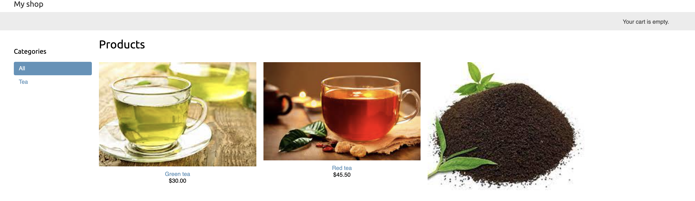
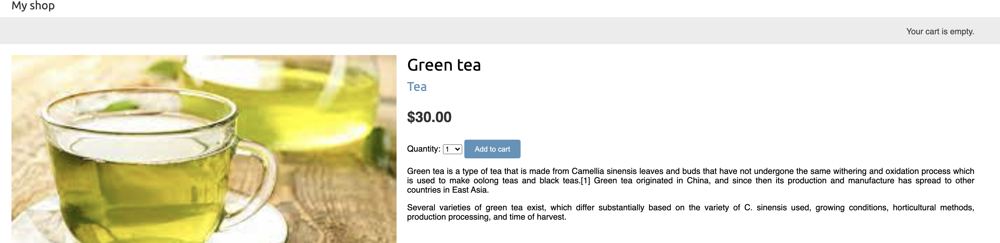
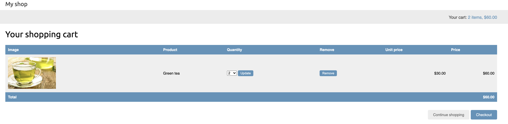
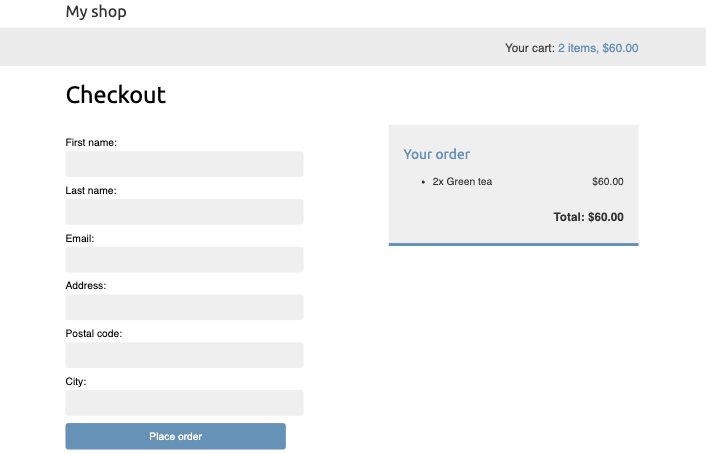
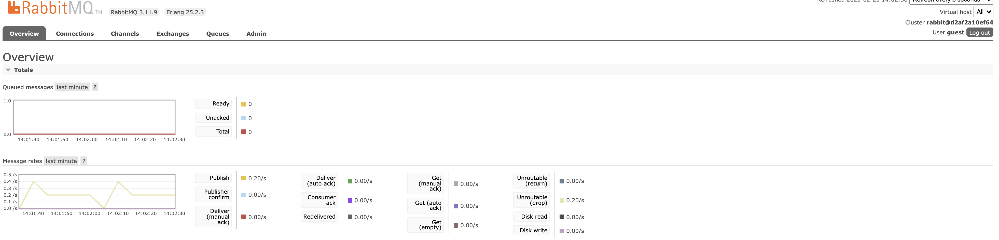
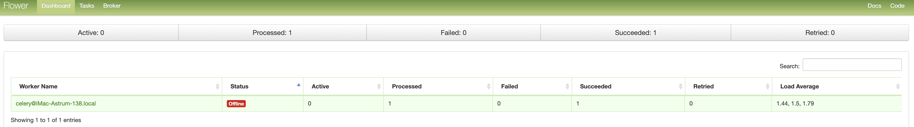

# Building-an-Online-Shop-django

<h2>In this chapter, you will learn how to:</h2>

- Create a product catalog

- Build a shopping cart using Django sessions

- Create custom context processors

- Manage customer orders

- Configure Celery in your project with RabbitMQ as a message broker

- Send asynchronous notifications to customers using Celery

- Monitor Celery using Flower

<h2>Creating an online shop project</h2>

Let’s start with a new Django project to build an online shop. Your users will be able to browse through a product catalog and add products to a shopping cart. Finally, they will be able to check out the cart and place an order. This chapter will cover the following functionalities of an online shop:

- Creating the product catalog models, adding them to the administration site, and building the basic views to display the catalog
- Building a shopping cart system using Django sessions to allow users to keep selected products while they browse the site
- Creating the form and functionality to place orders on the site
- Sending an asynchronous email confirmation to users when they place an order

<h2>let's start the project</h2>

- pip install -r requirements.txt
- python manage.py migrate
- python manage.py runserver
- docker pull rabbitmq #new terminal
- https://www.rabbitmq.com/download.html
- result : http://127.0.0.1:15672/
- celery -A myshop worker -l info #new terminal
- celery -A myshop flower #new terminal
- result : http://localhost:5555/dashboard
